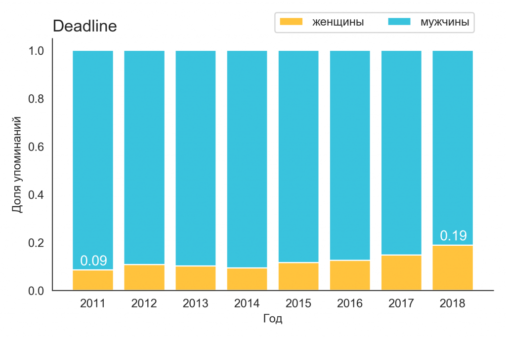

# Женщины-режиссеры в СМИ

> 

В 2010 году «Оскар» за лучшую режиссуру впервые получила женщина — Кэтрин Бигелоу с фильмом «Повелитель бури». Стали ли после этого режиссеры женского пола более заметными фигурами в киноиндустрии? Мы проследили динамику упоминаний женщин-режиссеров в статьях популярных киножурналов, чтобы ответить на этот вопрос.

# Сбор данных:
1) Сбор URL-ов статей: [детали](https://github.com/GimmeDanger/cinema-studies/tree/master/gathering_scripts/1-gather-urls)
2) Создание списка женщин-режиссеров: [детали](https://github.com/GimmeDanger/cinema-studies/tree/master/parse_scripts/1-parse-directors-wiki), [список](https://github.com/GimmeDanger/cinema-studies/tree/master/data/director_lists/wiki)
3) Сбор текстов статей и их метаданных: [архив-текстов](https://yadi.sk/d/OswDNo4H4aNBUQ), [сми-датасеты](https://github.com/GimmeDanger/cinema-studies/tree/master/data)

# Анализ данных
В качестве основной гипотезы мы предположили, что количество упоминаний женщин-режиссеров в СМИ значительно возрасло в течение последнего десятилетия. Если проанализировать динамику популярности запроса "female directors" в [google-trends](https://trends.google.com/trends/), то виден рост интереса аудитории к теме примерно вдвое.

Мы посчитали количество упоминаний женщин-,мужчин-режиссеров в статьях популярных американских кино-СМИ (The Hollywood Reporter, Variety, Deadline). Из списка рассматриваемых режиссеров пришлось предварительно исключить несколько мега популярных кинозвезд, формально попавших в список (Angelina Jolie, Natalie Portman и тд), но искажающих реальную картину популярности "настоящих" режиссеров.

Ниже представлены визуализации топ 10 мужчин/женщин режиссеров по числу упоминаний в рассмотренных СМИ:

> 

> 

> 

Далее рассмотрим изменение доли упоминаемости за последние 8 лет:

> 

> 

> 

В абсолютных значениях доля упоминаемости в Deadline возросла более чем в 2 раза (9% -> 19%), 
доли упоминаемости в Hollywood Reporter и Variety возросли в 1.5 раза (11% -> 17% и 12% -> 18% соответственно).
Можно заключить, что наблюдается определенное увеличение женщин-режиссеров, но оно представляется скорее эволюционным, а не революционным.

